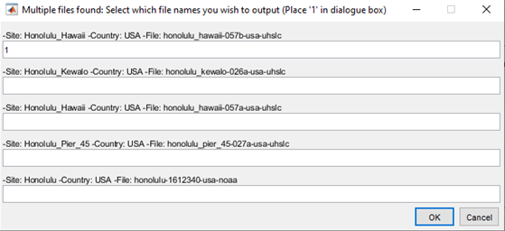
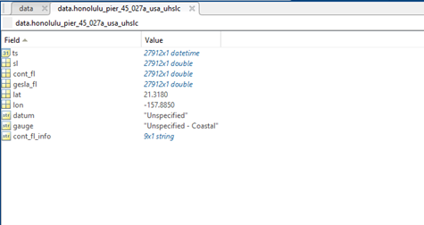
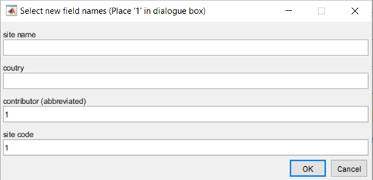
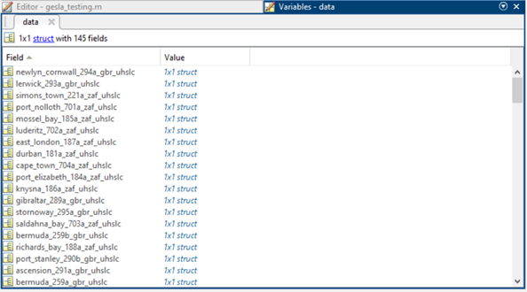
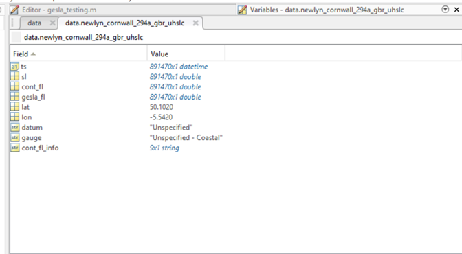

# GESLA-3
Matlab functions for the loading of GESLA3.0 datasets.
# Table of contents
- [Extracting a GESLA filename](#extracting-a-gesla-filename)
- [Load file/s](#load-file/s)
- [Change field names of structure array](#change-field-names-of-structure-array)
- [Load country or countries](#load-country-or-countries)
- [Load nearest from given coordinates](#load-nearest-from-given-coordinates)
- [Load from bounding box](#load-from-bounding-box)


# Quick User Guide


Define the path to the metadata file, where the GESLA data files are stored, and your flag removal preferences.


```matlab:Code
path='C:\Users\ljj1n20\OneDrive - University of Southampton\GESLA\data\GESLA3.0_ALL\'; %path to GESLA data files
metadata='C:\Users\ljj1n20\OneDrive - University of Southampton\GESLA\data\GESLA3_ALL 2.csv'; %metadata .csv file
gflag_removal = 'y'; %remove GESLA flagged data
cflag_removal = [3 4 5]; %remove contributor flags, where:
% 0 - no quality control
% 1 - correct value 
% 2 - interpolated value
% 3 - doubtful value
% 4 - isolated spike or wrong value
% 5 - missing value
```


`gesla.m` defines the `'gesla'` class that has static methods - so it's purpose is simply to store the functions within. To call the functions append `gesla.` to the beginning of a function: e.g., `gesla.load_site()`.


# Extracting a GESLA filename


To quickly gain the GESLA filename for a given site, use the `site_to_file` function. This function looks for filenames that contain a matching string to the input and then offers you the choice of all filenames with that matching string. Therefore you can give parts of the GESLA sitename rather than all: for example you can enter `'Honolulu'` rather than the full GESLA sitename of `'Honolulu_Hawaii'`. Place a '1' next to the filename/s you wish to output.


```matlab:Code
filename = gesla.site_to_file('Honolulu',metadata); %get user inputted filename/s from those containing 'Honolulu'
```

  
# Load file/s


Load one, or multiple, GESLA files into a structure array. 


Inputs: the GESLA filename/s, the path to the data files, and whether to remove GESLA flagged data ('y' for yes).


Outputs: a structure array containing a field for each site that within stores time, sea level, contributor flags, GESLA flags, contributor flag information, latitude, longitude, datum information and gauge type and information.


More information about inputs and outputs can be found within `gesla.m`.


```matlab:Code
data = gesla.load_file(filename,path,gflag_removal,cflag_removal); %load file 
```


Utilise `site_to_file` to load data without knowing the full GESLA filename.


```matlab:Code
data = gesla.load_file(gesla.site_to_file('Honolulu',metadata),path,gflag_removal,cflag_removal); %load user inputted file/s that contain 'Honolulu' in filename
```

*(see below for example of an output struct 'data' that contains data from Honolulu Pier provided by UHSLC)*


  
# Change field names of structure array


The field names of the structure aray output are, by default, GESLA filenames. Use `change_field_names` to change these to any combination of GESLA site names, country codes, contributor abbreviations and site codes for easier workflow. Place '1' next to the options to create the combination you want as the field names.


```matlab:Code
data = gesla.change_field_names(data,metadata); %change field names of struct 'data'
```


  
# Load country or countries


Load all files from a given country or countries.


```matlab:Code
data = gesla.load_country('NZL',path,metadata,gflag_removal,cflag_removal); %load all files from New Zealand
data = gesla.load_country(["GBR","ZAF"],path,metadata,gflag_removal,cflag_removal); %load all files from Great Britain and South Africa
```

*(see below for example of an output struct 'data' that contains all files from Great Britain and South Africa, and an example of the data within the field of 'newlyn_cornwall_194a_gbr_uhslc')*

 


# Load nearest from given coordinates


Load a given number of files whose gauges are closest to the given coordinates in Euclidean distance.


```matlab:Code
data = gesla.load_nearest([-5 45],5,path,metadata,gflag_removal,cflag_removal); %load the 5 nearest gauges to specified lon,lat
```

# Load from bounding box


Load all files from gauges within the bounding box specified.


```matlab:Code
data = gesla.load_bbox([50 45 -5 0],path,metadata,gflag_removal,cflag_removal); %load all gauges within the bbox of [northernmost extent, southernmost extent, westernmost extent, easternmost extent
```

# Gesla - Parallel Computing 
### requires the Parallel Computing Toolbox

I will try to update the code with more big data/parallel computing solutions as and when I have time. 

To start I have created `gesla_p.m` that adds the parallel for loop function `parfor()` to load in sites simultaneously. This will improve speeds with large amounts of data but the time it takes to start a workers pool will cause the script to be slower on smaller amounts of data.

`gesla_p.m` follows the same syntax as `gesla.m` but with an added input `'nw'` to the load functions. `nw` is the number of workers for a pool, it will only create a pool if there is no pool currently active and will not override a current running pool even if the number of workers is different.

E.g.,
```matlab:Code
nw = 6;
data = gesla_p.load_bbox([50 45 -5 0],path,metadata,gflag_removal,cflag_removal,nw); %run previous bbox code in parallel for loop with a workers pool of 6
```
